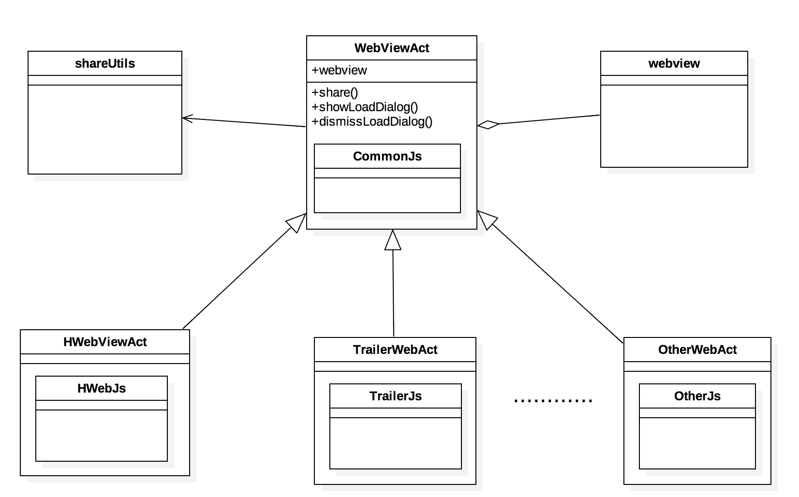

##WebViewAct改造

下面是我改造webviewact的心路历程；～～～～～～～～

* 原结构

	结构类图:
	

	具体结构看代码

	优点：
	
	* 分享父类集成了，子类不用实现；
	* 可满足复杂页面，复杂页面完全可自定义；
	* 一个js对应一个页面，对应关系清晰，寻找修改点方便；
	
	缺点：

	* 分享功能和act完全耦合，不通用；	
	* webview不可自由替换，act依赖于具体的webview，一旦webview接口变化，所有子类需要修改；
	* js没有统一基类约束，且功能重复部要重复编码；
	* js不可重复利用，与页面完全耦合；

* 设想的结构 
	目的： 
	统一Activity，使用通用的webview； 
	分享功能抽成工具类，不再单独占一个类层级； 
	解决js和页面耦合； 
	统一的js，并实现通用功能； 
	webview以后可以自由替换； 
	
	结构类图:
	

	优点：
	
	* 分享抽出，不占类层级；
	* webview可以完全自由替换；
	* WebViewAct和具体的js分离；
	* Act子类不用实现通用功能，直接使用接口；
	
	缺点：
	
	* 结构比较复杂
	* 需要在js子类种配置页面；
	* 改造的过程艰辛，以后的开发方式完全改变；
	* 复杂页面通常无法通过配置解决，依旧需要拓展WebViewAct；
	* 增加通用接口困难，修改的话要在基类修改，违反了开闭原则；
	* ui的配置和js是耦合的；
	* js需要知道context的生命周期，并做控制；
	* 无法和前端的设计完全match；

* 最后修正的方案

	结构类图:
	

	优点：

	* 结构简单爆炸；	
	* 分享抽出，不占类层级；
	* webview可以比较自由得替换（但以后替换依旧需要抽象出接口，但这个几乎不会成为问题，除非有谁写出来个和android的webview接口不一样的webview，而且我们要用它的时候才会出现这个问题）；
	* Act子类不用实现通用功能，直接使用接口；
	* 一个js对应一个页面，对应关系清晰，寻找修改点方便；
	
	缺点：
	
	* js不可重复利用（可以不看成是缺点了）；
	* js注册的name覆盖的问题（CommonJs需要和各个页面js有父子关系）；
	* 无法通过配置来实现不同的需求了，只要有些许变化，都必须拓展WebViewAct;

                                                                                                       

### 如果一切有如果的话 那么方案可能可以是这样：
* 个人认为理想的方案
	
	想法是这样的：从设计上就特么杜绝了要修改基础接口这件事情，然后大致使用第二种设计方案，那么一切都干净了，那么类图就是这样：

	
	优点：
	
	* 客户端开发要做的事情就是不断拓展BaseJs；
	* 类简单爆炸，好理解爆炸；
	
	缺点：
	
	* 需要和前端定义通用的url；
	* 解析url有性能损耗；
	* BaseJs的实现类不能有ui交互，需要全部交给前端去做；
	* 那么一些ui会和原生的ui会看起来差别很大；

	ms：如果真是这样实现，那么前端的代码量应该就变多了；客户端应该会很爽，只要写好对应的url解析，和回调代码；
	
	
	
	
